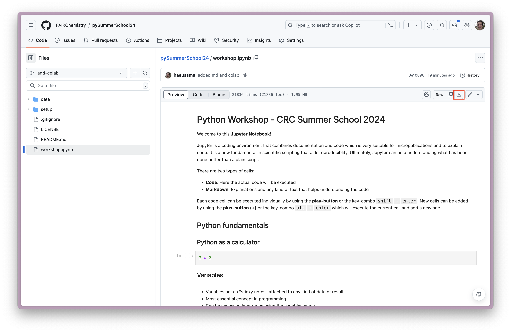
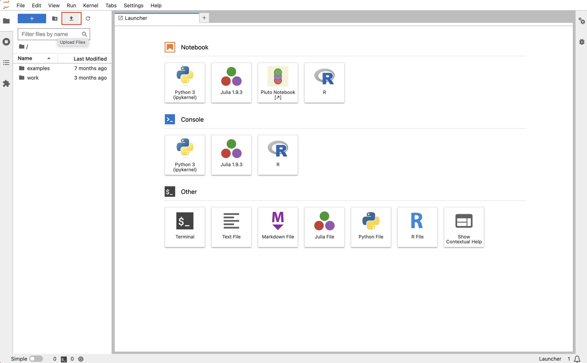

# Python Workshop - CRC Summer School 2024

In this workshop, we will cover the basics of Python programming language and demonstrate in a titration study example how Python can be used to analyze and visualize data that exeed the capabilities of Excel.

## If you don't have access to the Jupyter Hub of Uni Stuttgart
If you do not have access to the Jupyter Hub of Uni Stuttgart, you can get the the workshop material by clicking the button below. This will open the workshop material in Google Colab, a free online Jupyter notebook environment.  

## If you have access to the Jupyter Hub of Uni Stuttgart
If you have access to the Jupyter Hub of Uni Stuttgart, you can download go to the Workshop Notebook on GitHub and download it

1. Go th the [Workshop Notebook](https://github.com/FAIRChemistry/pySummerSchool24/blob/add-colab/workshop.ipynb)
2. Click on the arrow pointing down on the top right of the page to download the notebook.

After downloading the notebook, you can upload it to the Jupyter Hub by following these steps:

1. Log in to the Jupyter Hub of [Uni Stuttgart](https://jupyterhub.tik.uni-stuttgart.de/) using your AC or GS credentials.
2. Select the `Create Data Science Notebook` option.
3. Click on the arrow pointing up in the top left of the page to upload the notebook and upload the downloaded notebook.

4. Open the notebook uploaded notebook by double-clicking on it.